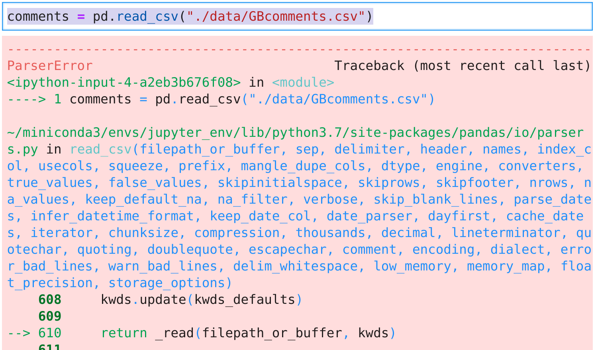
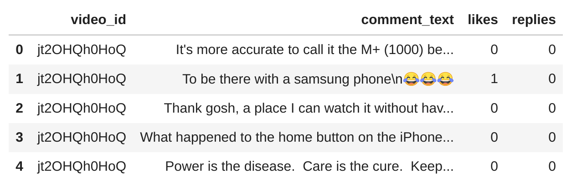
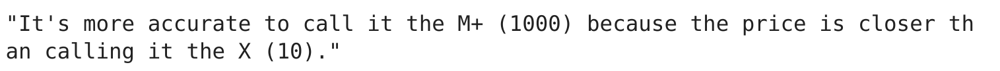
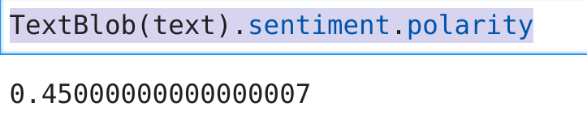
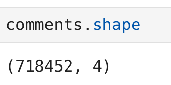
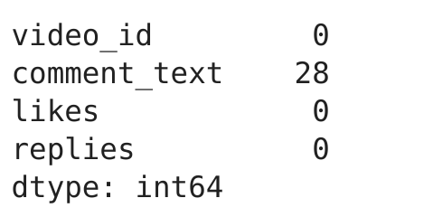
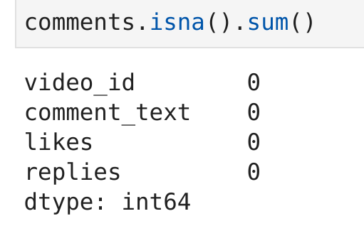

# Project-1: Text Data Analysis
# 1. Realización de análisis de sentimiento
0. [Insalamos la librería  textblob](#schema0)
1. [Importamos librerías](#schema1)
2. [Cargamos los datos](#schema2)
3. [Vamos hacer una prueba de análisis de una frase](#schema3)
4. [Vamos a comprobar si hay nulos y si hay nulos los eliminamos.](#schema4)
5. [Vamos a crear una lista con todas la polaridades de los comentarios y añadirlo al dataset como una columna nueva](schema5)

# 0. Instalamos la librería textblob

Nosotros lo instalamos con conda porque estamos trabajando con un environment de conda
~~~python
conda install -c conda-forge textblob
~~~
Documentación

https://textblob.readthedocs.io/en/dev/

# 1. Importamos librerías
~~~python
import pandas as pd
import numpy as np
import matplotlib.pyplot as plt
import seaborn as sns
from textblob import TextBlob
~~~

# 2. Cargamos los datos
Al cargarlo así nos da un error:
~~~python
comments = pd.read_csv("./data/GBcomments.csv")
~~~

Lo solucionamos poniendo `error_bad_lines = False`
~~~python
comments = pd.read_csv("./data/GBcomments.csv", error_bad_lines = False)
~~~

# 3. Vamos hacer una prueba de análisis de una frase
La puntuación de polaridad es un valor flotante dentro del rango [-1.0, 1.0]. 
La subjetividad es un flotador dentro del rango [0.0, 1.0] donde 0.0 es muy objetivo y 1.0 es muy subjetivo.

~~~python
text = comments.iloc[0].comment_text
~~~

En este caso el mensaje es bastante positivo
~~~python
TextBlob(text).sentiment.polarity
~~~

# 4. Vamos a comprobar si hay nulos y si hay nulos los eliminamos.
Comprobamos la cantidad de elementos que hay en `comments`, como vemos hay bastantes comentarios, ahora vamos a ver si hay nulos y sí los hay los podremos borrar ya que el número de comentarios es muy grande.
~~~python
comments.shape
~~~

~~~python
comments.isna().sum()
~~~

Lo eliminamos
~~~python
comments.dropna(inplace= True)
~~~

# 5. Vamos a crear una lista con todas la polaridades de los comentarios y añadirlo al dataset como una columna nueva
~~~python
polarity = []
for comment in comments["comment_text"]:
    polarity.append(TextBlob(comment).sentiment.polarity)

comments["polarity"] = polarity
~~~