# Project-1: Text Data Analysis
# a.- Realización de análisis de sentimiento
0. [Insalamos la librería  textblob](#schema0)
1. [Importamos librerías](#schema1)
2. [Cargamos los datos](#schema2)
3. [Vamos hacer una prueba de análisis de una frase](#schema3)
4. [Vamos a comprobar si hay nulos y si hay nulos los eliminamos.](#schema4)
5. [Vamos a crear una lista con todas la polaridades de los comentarios y añadirlo al dataset como una columna nueva](schema5)
#  b.- Representación de Wordcloud de Sentimientos
6. [Creamos un dataset nuevo que solo contenga los valores de polarity = 1](#schema6)
7. [Instalamos WordCloud e importamos la librería](#schema7)
8. [Creamos la lista de `STOPWORDS` y hacemos que los comentarios es una cadena](#schema8)
9. [Creamos el tamaño de imagen](#schema9)
10. [Dibujamos la figura con el texto más positivo](#schema10)
11. [Dibujamos la figura con el texto más negativo](#schema11)

# c.- Analizar etiquetas de tendencias y vistas de Youtube

# 0. Instalamos la librería textblob

Nosotros lo instalamos con conda porque estamos trabajando con un environment de conda
~~~python
conda install -c conda-forge textblob
~~~
Documentación

https://textblob.readthedocs.io/en/dev/

# 1. Importamos librerías
~~~python
import pandas as pd
import numpy as np
import matplotlib.pyplot as plt
import seaborn as sns
from textblob import TextBlob
~~~

# 2. Cargamos los datos
Los datos que vamos a usar estan alojados aqui: https://drive.google.com/drive/u/0/folders/10owYwrtRQIRCawOFgZy1qY7gG3ta8VfS
Al cargarlo así nos da un error:
~~~python
comments = pd.read_csv("./data/GBcomments.csv")
~~~

Lo solucionamos poniendo `error_bad_lines = False`
~~~python
comments = pd.read_csv("./data/GBcomments.csv", error_bad_lines = False)
~~~

# 3. Vamos hacer una prueba de análisis de una frase
La puntuación de polaridad es un valor flotante dentro del rango [-1.0, 1.0]. 
La subjetividad es un flotador dentro del rango [0.0, 1.0] donde 0.0 es muy objetivo y 1.0 es muy subjetivo.

~~~python
text = comments.iloc[0].comment_text
~~~

En este caso el mensaje es bastante positivo
~~~python
TextBlob(text).sentiment.polarity
~~~

# 4. Vamos a comprobar si hay nulos y si hay nulos los eliminamos.
Comprobamos la cantidad de elementos que hay en `comments`, como vemos hay bastantes comentarios, ahora vamos a ver si hay nulos y sí los hay los podremos borrar ya que el número de comentarios es muy grande.
~~~python
comments.shape
~~~

~~~python
comments.isna().sum()
~~~

Lo eliminamos
~~~python
comments.dropna(inplace= True)
~~~

# 5. Vamos a crear una lista con todas la polaridades de los comentarios y añadirlo al dataset como una columna nueva
~~~python
polarity = []
for comment in comments["comment_text"]:
    polarity.append(TextBlob(comment).sentiment.polarity)

comments["polarity"] = polarity
~~~
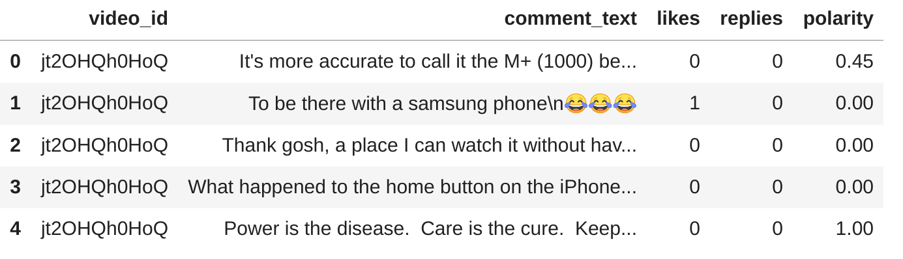

# 6.  Creamos un dataset nuevo que solo contenga los valores de polarity = 1

~~~python
comments_positive = comments[comments["polarity"] == 1]
comments_positive.head()
~~~
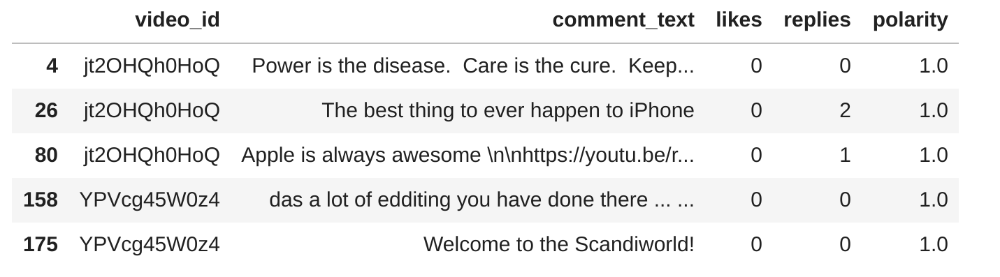
~~~python
comments_positive.shape
~~~
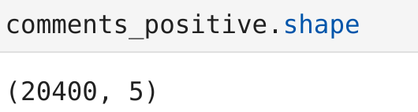

# 7. Instalamos WordCloud e importamos la librería

https://amueller.github.io/word_cloud/auto_examples/masked.html?highlight=stopwords
~~~python
conda install -c conda-forge wordcloud
~~~
~~~python
from wordcloud import WordCloud,STOPWORDS
~~~

# 8 Creamos la lista de `STOPWORDS` y hacemos que los comentarios es una cadena
~~~python
stopwords = set(STOPWORDS)
total_comments = " ".join(comments_positive["comment_text"])
~~~
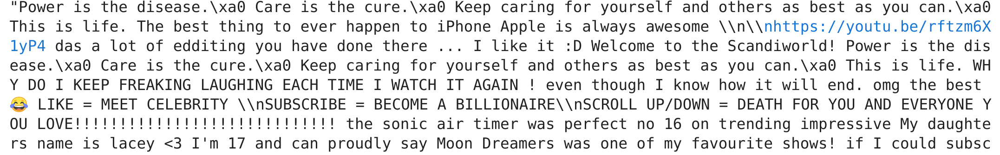

# 9. Creamos el tamaño de imagen
~~~python
wordcloud = WordCloud(width = 1000, height= 500, stopwords= stopwords).generate(total_comments)
~~~

# 10. Dibujamos la figura con el texto más positivo
~~~python
plt.figure(figsize=(15,5))
plt.imshow(wordcloud)
plt.axis("off")
plt.savefig("./images/WordCloud.png")
~~~
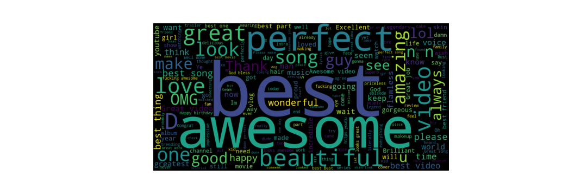

# 11. Dibujamos la figura con el texto más negativo
~~~python
comments_negative = comments[comments["polarity"] == -1]
total_comments_neg = " ".join(comments_negative["comment_text"])

wordcloud = WordCloud(width = 1000, height= 500, stopwords= stopwords).generate(total_comments_neg)

plt.figure(figsize=(15,5))
plt.imshow(wordcloud)
plt.axis("off")
plt.savefig("./images/WordCloud_neg.png")
~~~
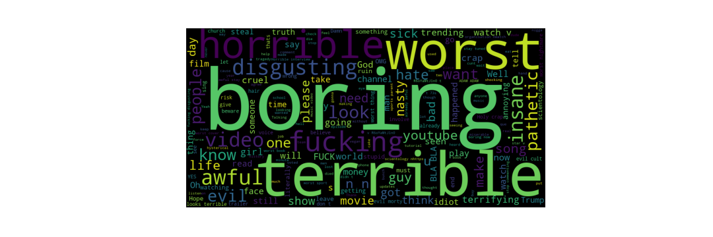

# 12. Cargamos librerías y datos

~~~python
import pandas as pd
import numpy as np
import matplotlib.pyplot as plt
import seaborn as sns
import re
videos = pd.read_csv("./data/USvideos.csv", error_bad_lines = False)
~~~
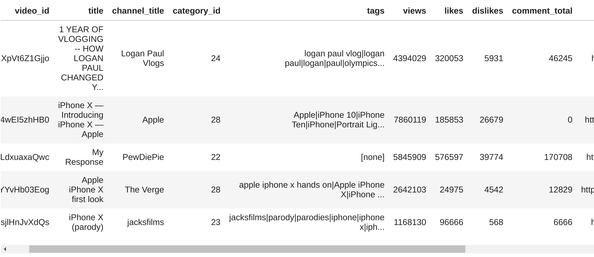

# 13 . Creamos una cadena con todos los tags y le aplicamos una expersión regular
Primero le quitamos cualquier símbolo que no sean letras, 
Segundo le quitamos si tiene más de un espacio
~~~python
tags_complete = " ".join(videos["tags"])
~~~
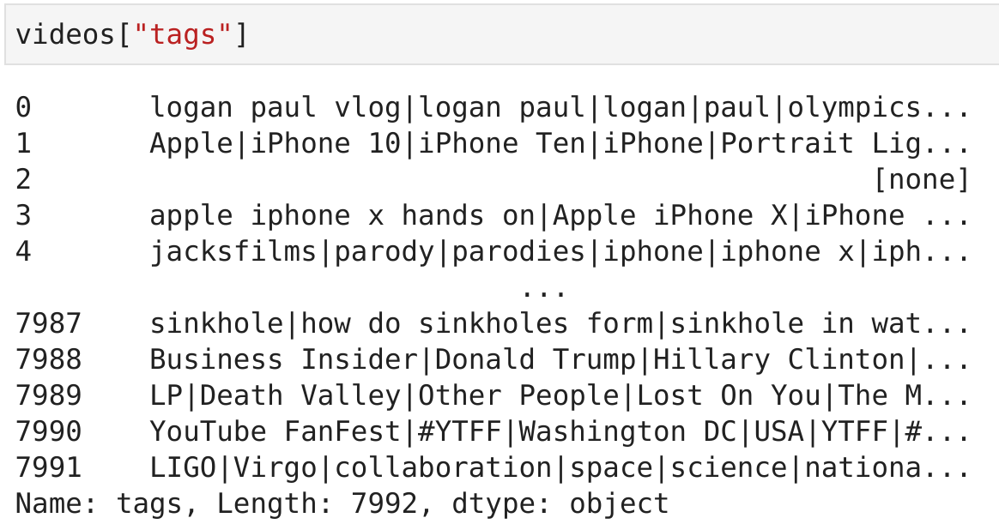
~~~python
tags = re.sub('[^a-zA-Z]',' ', tags_complete)
~~~
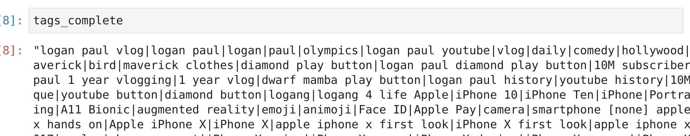
~~~python
tags = re.sub(' +', ' ', tags)
~~~
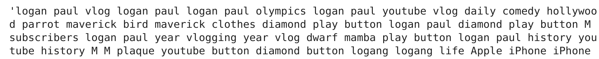

# 14. Dibujamos la figura con tags

~~~
stopwords = set(STOPWORDS)
wordcloud = WordCloud(width = 1000, height= 500, stopwords= stopwords).generate(total_comments_neg)

plt.figure(figsize=(15,5))
plt.imshow(wordcloud)
plt.axis("off")
plt.savefig("./images/WordCloud_neg.png")
~~~
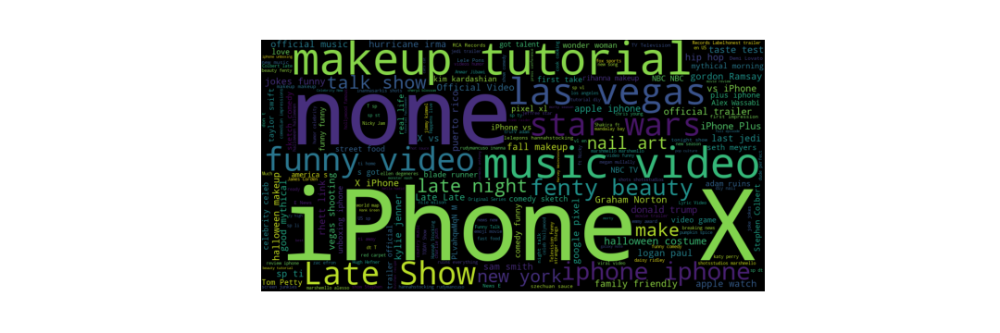

# 15. Dibujamos regresiones con los likes y dislikes

~~~python
sns.regplot(data = videos, x = "views", y = "likes")
plt.title("Regression plot for views & likes")
plt.savefig("./images/regression.png")
~~~
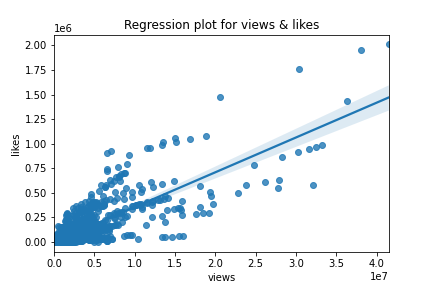
~~~python
sns.regplot(data = videos, x = "views", y = "dislikes")
plt.title("Regression plot for views & dislikes")
plt.savefig("./images/regression_dislikes.png")
~~~
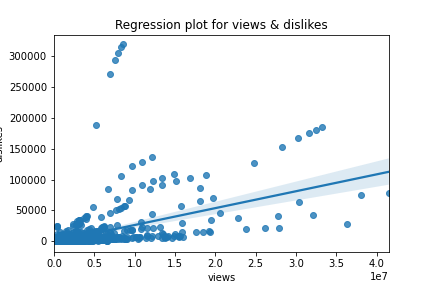

# 16. Vamos a generar una matrix de correlacción
~~~python
sns.heatmap(df_corr.corr(), annot =True)
plt.title("Correlation")
plt.savefig("./images/corr.png")
~~~
